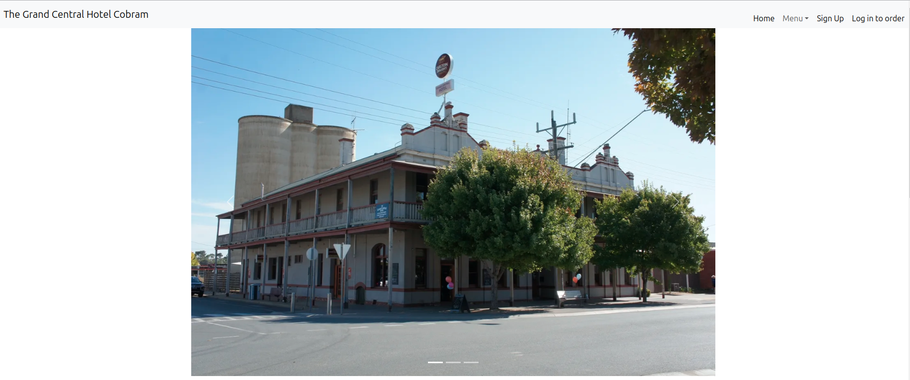
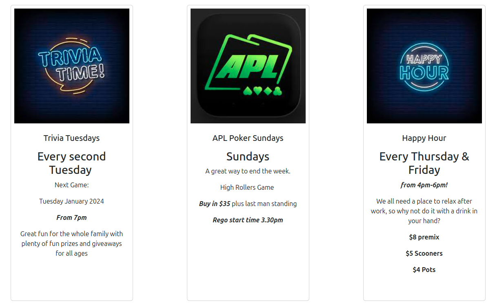
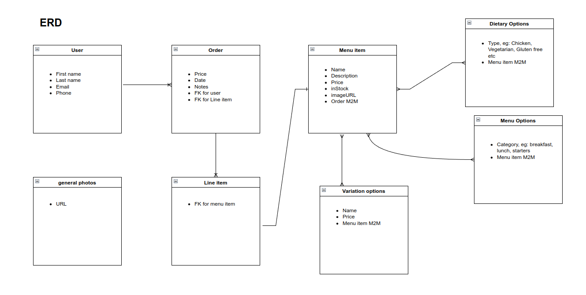
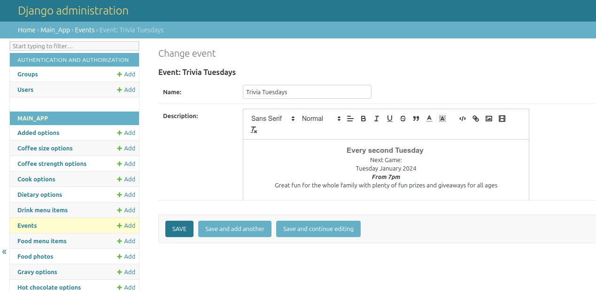
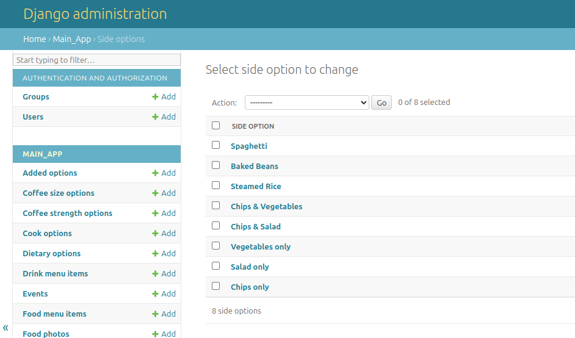
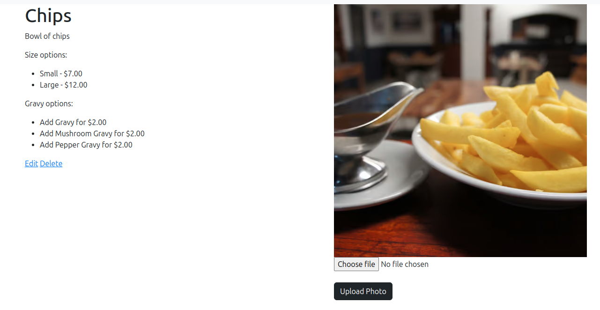
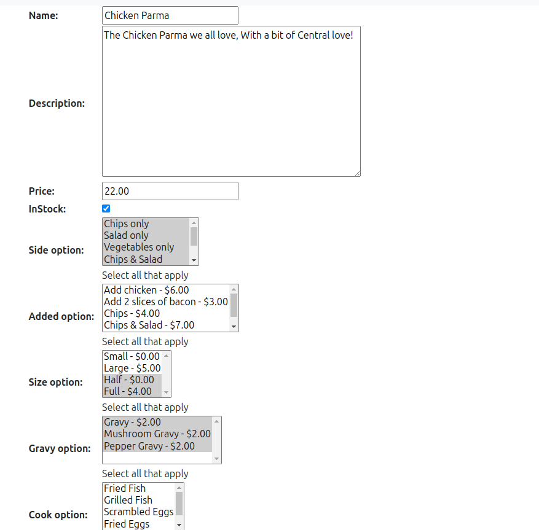
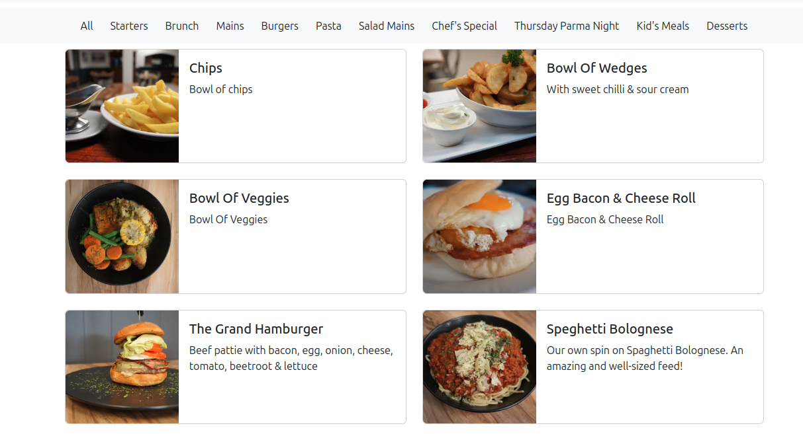

# Grand Central Hotel Cobram Website

## Overview

The Grand Central Hotel Cobram is a pub in Northern Victoria that serves food, drinks, both eat-in and delivered, and hosts a number of regular events.  This project (still under development) is an e-commerce website with a focus on maximising the client's ability to manage their own site.  It features full CRUD functionality on any elements that could change, primarily the events and menu.

At the moment The Grand Centarl Hotel is using:
* GoDaddy to host their website
* Mr Yum to host their menu and look after ordering
* Stripe to process payments
* Doshii to link the site to their in-house software
* Impos for their POS software.

This project hopes to elimiate as many 3rd-party providers as possible, saving the admin staff on-site time, effort and money.

The site is currently live on heroku and can be visited [here](https://grandcentral-e0ebd1401088.herokuapp.com/).

#### Homepage

#### Events

### Current functionality
* Admin staff can CRUD Food & Drink Items, including various options (eg, sides, size of meals, gravy, etc.), as well as events.
* Customers can view the events and menu.
* After creating an account, customers can add various menu items to their order and view what is currently there.

### Currently being developed
* Updates to the drinks menu and functionality.
* Ability to remove items from order, view total dollar amount and finalise order.
* General CSS improvements across site.
* Filter menus by type, eg. mains, starters, coffee, etc.
* Adding to the homepage:
    * live music events
    * book table
    * opening hours
    * contact information
    * "We're Hiring" form.

### Upcoming development
* Add "continue as guest" functionality.
* Allow users with an account to view past orders.
* Process payments through site.
* Add live feature to let customers know when to expect the order.
* Add restriction to the delivery radius (perhaps with the use of Google Maps API).
* Add restrictions to when orders can be placed determined by time and day.

### Future development
* Replace the front-end with React (if required).
* Link website to onsite POS software which would allow orders made on the site to be printed directly in the kitchen for processing.

## ERD

The below image is a simplified version of the Entity Relationship Diagram.  It includes one-to-one, one-to-many and many-to-many relationships between the different models used throughout the site.

## Technologies used
* VS Code
* Github
* Built with Django, Python and JavaScript
* Currently hosted by Heroku
* Bootstrap CSS
* Amazon Web Services for image hosting
* Quill for improved admin layout functionality

### Django backend

### CRUD-functionality on website

### Customer view
